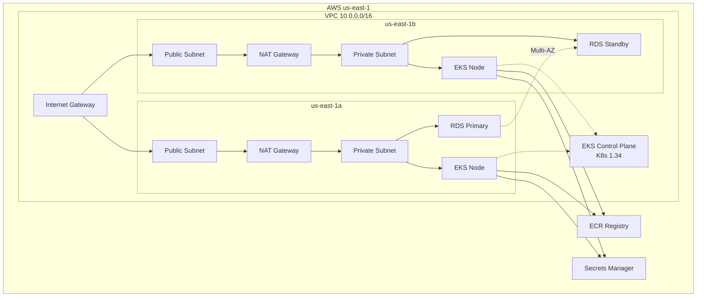

# PawaPay Infrastructure

AWS infrastructure for the ConfigMirror Kubernetes operator, built with Terraform and Terragrunt. Includes remote state management, DRY configuration and security controls.

## Architecture Overview

Deploys EKS (K8s 1.34), RDS (PostgreSQL 17.6), ECR, VPC (Multi-AZ), IAM roles and GitHub OIDC for CI/CD.



### Network Architecture

```
VPC (10.0.0.0/16)
├── AZ us-east-1a
│   ├── Public Subnet (10.0.1.0/24)  - NAT Gateway, Load Balancers
│   └── Private Subnet (10.0.10.0/24) - EKS Nodes, RDS
└── AZ us-east-1b
    ├── Public Subnet (10.0.2.0/24)  - NAT Gateway (HA)
    └── Private Subnet (10.0.20.0/24) - EKS Nodes, RDS (Multi-AZ)
```

## Directory Structure

```
infra/
├── modules/
│   ├── vpc/
│   ├── iam/
│   ├── ecr/
│   ├── rds/
│   ├── eks/
│   └── github-oidc/
├── _global/
│   └── ecr/
├── environments/
│   └── dev/
│       ├── vpc/
│       ├── iam/
│       ├── rds/
│       ├── eks/
│       └── github-oidc/
├── scripts/
│   ├── bootstrap.sh
│   └── terraform-policy.json
└── .github/workflows/
```

## Prerequisites

### Tools needed

- AWS CLI 2.0+
- Terraform 1.9+ (using 1.13.3)
- Terragrunt 0.78.0+
- kubectl 1.34+

## AWS Configuration

### AWS Setup

Configure credentials:
```bash
aws configure
```

Verify access:
```bash
aws sts get-caller-identity
```

Required permissions: EC2, EKS, RDS, ECR, IAM, S3, DynamoDB, CloudWatch, Secrets Manager. Using AdministratorAccess for dev is fine, or use the least-privilege policy in `scripts/terraform-policy.json`.

## Configuration

Main config is in `environments/dev/terragrunt.hcl`. You might want to:

- Restrict EKS API access to your IP (get it with `curl ifconfig.me`)
- Change instance types (using t3.small for nodes)
- Adjust node count (default is 2 nodes, min 1, max 4)

## CI/CD Pipeline

GitHub Actions workflow with Terraform formatting, TFLint, Checkov security scanning and OIDC authentication.

## State Management

Uses S3 (`pawapay-terraform-state-<account-id>`) with DynamoDB locking (`pawapay-terraform-locks`).

If state gets locked:
```bash
aws dynamodb scan --table-name pawapay-terraform-locks --region us-east-1
terragrunt force-unlock <lock-id>
```

## Deployment

### Step 1: Bootstrap Infrastructure

Run the bootstrap script to create S3 bucket, DynamoDB table, GitHub OIDC provider, and IAM roles:

```bash
./scripts/bootstrap.sh
```

This will set up:
- S3 bucket for Terraform state with encryption and versioning
- DynamoDB table for state locking
- GitHub OIDC provider for CI/CD
- IAM role for Terraform GitHub Actions
- IAM user for local development

After bootstrap completes, add the GitHub secret to allow CI/CD. The script will output the role ARN - add it as `AWS_ROLE_ARN` secret in your repo settings.

### Step 2: Deploy Infrastructure

Deploy everything:
```bash
cd environments/dev
terragrunt run --all init
terragrunt run --all plan
terragrunt run --all apply
```

Or deploy in order: VPC, IAM, ECR (_global/ecr), RDS, EKS, GitHub OIDC

### Step 3: Verify

```bash
aws eks update-kubeconfig --name pawapay-eks-dev --region us-east-1
kubectl get nodes
```

Check outputs:
```bash
cd environments/dev
terragrunt run --all output
```

## Accessing Resources

### kubectl access

Two IAM roles are created for EKS access:
- `pawapay-eks-dev-admin` - full cluster admin
- `pawapay-eks-dev-user` - edit in default namespace, view in kube-system

To use them, assume the role and update kubeconfig:
```bash
aws eks update-kubeconfig --name pawapay-eks-dev --region us-east-1 --role-arn <role-arn>
```

### RDS

Get credentials from Secrets Manager:
```bash
aws secretsmanager get-secret-value --secret-id pawapay-rds-credentials --region us-east-1 --query SecretString --output text
```

### ECR

Push images:
```bash
aws ecr get-login-password --region us-east-1 | docker login --username AWS --password-stdin $(aws sts get-caller-identity --query Account --output text).dkr.ecr.us-east-1.amazonaws.com
docker push <ecr-url>:tag
```

## Troubleshooting

Common issues:

**S3 backend error**: Run bootstrap script first

**EKS cluster creation fails**: Deploy IAM module first (`cd environments/dev/iam && terragrunt apply`)

**RDS subnet error**: Deploy VPC first

**kubectl connection issues**:
```bash
aws eks update-kubeconfig --name pawapay-eks-dev --region us-east-1
```

Enable debug logs if needed:
```bash
export TERRAGRUNT_DEBUG=1
export TF_LOG=DEBUG
```

## Security & Assumptions

RDS has encryption and passwords in Secrets Manager. Nodes and RDS are in private subnets. EKS control plane logging is on. State is encrypted in S3. kubectl access through IAM roles. GitHub OIDC for CI/CD so no hardcoded AWS keys.

**Assumptions made:**
- Single region deployment (us-east-1) - can be changed in root.hcl
- Multi-AZ setup with 2 availability zones for high availability
- VPC CIDR 10.0.0.0/16 - configurable via TG_VPC_CIDR env var
- EKS public endpoint is set to 0.0.0.0/0 with IAM auth - all requests need valid AWS credentials. Makes it easier for dynamic IPs and GitHub Actions. In production we'd lock this down to specific IPs or go private-only with VPN.
- EKS control plane placed in private subnets for security
- RDS master username is "postgres" - standard default

## Cleanup

Destroy everything:
```bash
cd environments/dev
terragrunt run --all destroy
```

Then remove state bucket and DynamoDB table:
```bash
export AWS_ACCOUNT_ID=$(aws sts get-caller-identity --query Account --output text)
aws s3 rm s3://pawapay-terraform-state-${AWS_ACCOUNT_ID} --recursive
aws s3api delete-bucket --bucket pawapay-terraform-state-${AWS_ACCOUNT_ID} --region us-east-1
aws dynamodb delete-table --table-name pawapay-terraform-locks --region us-east-1
```
